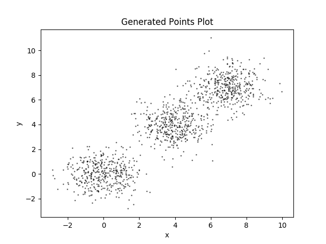
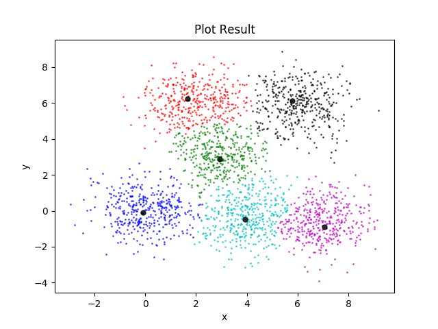

# Density Peak Clustering 

## 1. Dependencies

**Python:**  `3.6.7`

**Lib:**  `numpy, matplotlib`

## 2. Files

- **data:** Given data from this essay
- **images:** Generated images for constructing framework
- **references:** Essays used for this projects
- **report:** Records and report
- **data_process.py:** Data processing
- **cluster.py:** Find cluster center and classify points
- **setup.py:** Process given data and visualizing
- **generatePoints.py:** Generating testing points dataset
- **plot.py:** Process generated data and visualizing

## 3. Usage

- Show the performance on given dataset:

`>_ python3.6 setup.py`

- Show the performance on generate dataset:

`>_ python3.6 generatePoints.py`

`>_ python3.6 plot.py`

## 4. Performances

- Dataset to be clustering:

- After clustering:

