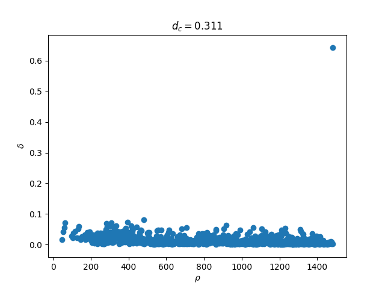
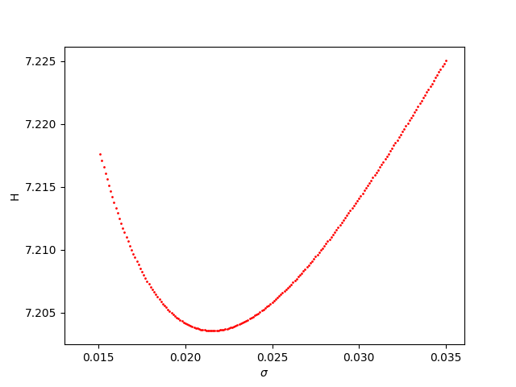
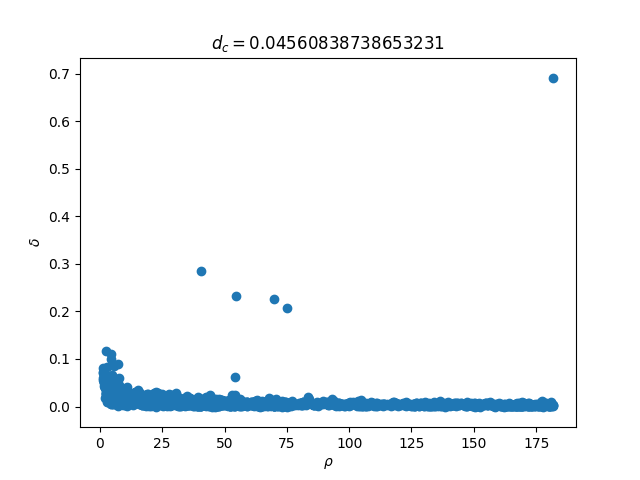
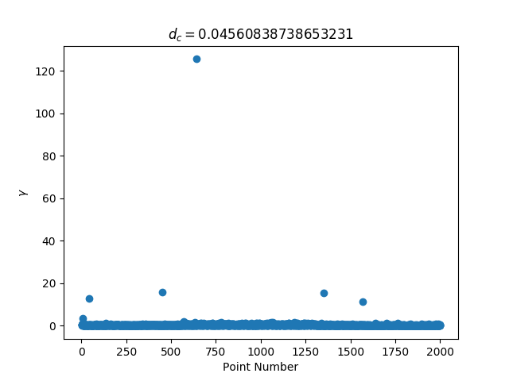
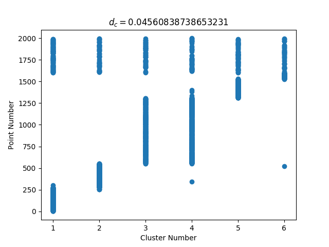
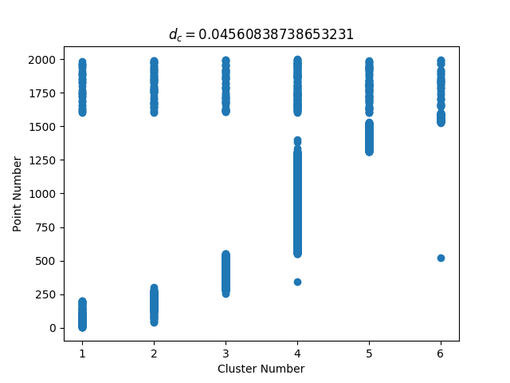

# Density Peak Clustering

## 1. 引言

本次Project完成了 [[1]](https://people.sissa.it/~laio/Research/Res_clustering.php) 中提出的一种新型聚类算法，对其性能分析，并进行了相关优化。

## 2. 算法实现

### 2.1 数据处理

数据来自作者在 [Supplementary Materials](http://www.sciencemag.org/content/344/6191/1492/suppl/DC1) 中提供的数据。其中存储`1 - 1999`数据点及其各点之间距离，数据格式为$(p1, p2, distance(p1, p2))$，根据给定的数据格式初始化，映射各点对和其距离，保存到字典中，同时计算出数据中数据点个数。

#### 2.1.1 局部密度$\rho_i$

- **Cut-off Kernel**

给定截断距离$d_{c} > 0$，采用Cut-off kernel方式计算局部密度，由$\rho_{i}=\Sigma_{j}\chi(d_{ij}-d_{c})$且$\chi(x) = 1\text{ if } x<0\text{ and }\chi(x)=0\text{ otherwise}$，这种方式计算局部密度$\rho_i$为连续值。

- **Gaussian kernel**

给定截断距离$d_{c} > 0$，采用Gaussian kernel方式计算局部密度，由$\rho_{i}=\Sigma_{j}e^-(\frac{d_{ij}}{d_{c}})^2$且$\chi(x) = 1\text{ if } x<0\text{ and }\chi(x)=0\text{ otherwise}$，这种方式计算局部密度$\rho_i$为离散值。

#### 2.1.2 最小距离$\delta_i$

由最小距离的定义可知，当点$i$不是局部密度最高的点时有$\delta_i=min_{j:\rho_j>\rho_i}(d_{ij})$，否则$\delta_i=max_j(d_{ij})$.

若点$i$是最高密度点，则其最小距离是点集$S$中与其距离最大的距离，否则最小距离是局部密度比$i$高的点中与其距离最小的点。

故对局部密度进行降序排序处理后，求最小距离，返回最小距离字典，同时返回最小距离对应的点对字典，方便后面的cluster划分。

#### 2.1.3 聚类中心

对于任意点$i$，同时具有较大的$\rho_i$和$\delta_i$，则更有可能成为聚类中心，采用Guassian计算局部密度，截断距离$d_c$取`0.311`，根据此规则画出$(\rho_i,\delta_i)$的**决策图**如下：



文章中提出对$(\rho_i,\delta_i)$，定义$\gamma_i=\rho_i\delta_i$为聚类中心的划分标准，画出图像如下：


文章中对截断距离$d_c$的选取没有作任何介绍，只说按照效果自行选择最佳值，这就导致了如上图所示效果，无法选择除了最突出点之外的其余聚类中心，因此对$d_c$的取值需要衡量，在将值从`0.511`不断下调的过程中发现效果不断变好，但任然不能很准确的判断聚类中心应该选择的个数。

### 2.2 $d_c$优化

在一篇对[\[1\]](../references/DPC.pdf)的comment中找到了很好的对截断距离进行选择的算法，优化针对的Gaussian function计算的的局部密度，具体见[\[2\]](../references/d_c.pdf)。下面简要介绍其算法：

#### 2.2.1 Potential Of Point(POP)

对一个数据集$\{x_1,x_2,...,x_n\}$，每个点的potential计算公式为$\varphi(x)=\Sigma_{i=1}^n\big(e^-(\frac{||x-x_i||}{\sigma})^2\big)$，类似Gaussian kernel的计算，其中$||x-x_i||$代表欧式几何空间的$x$与$x_i$的距离，$\sigma$为需要确定的变量值。

#### 2.2.2 Entropy

对一个POP集$\{\varphi_1,\varphi_2,...,\varphi_n\}$，定义数据域的熵值$H=-\Sigma_{i=1}^n(\frac{\varphi_i}{Z})log(\frac{\varphi_i}{Z})$，熵值代表数据域的混乱度，我们需要求使得$H$最小的变量$\sigma$。

下图直观展示了$H$随$\sigma$的变化趋势：



#### 2.2.3 $d_c$的选取

随着$\sigma$从0不断增加到$\infty$，熵值递减再递增，故取使得熵值最小的$\sigma$值，根据Gaussian分布的3B原则，每个点的影响半径为$\frac{3}{\sqrt{2}}\sigma$，取该值为截断距离$d_c=$  `0.0456`，此时生成决策图如下：



定义$\gamma_i=\rho_i\delta_i$为聚类中心的划分标准，图像如下:



### 2.3 聚类过程

#### 2.3.1 聚类中心

由上图很容易得到聚类中心点共六个，易得聚类中心列表`[1061, 1515, 400, 6, 1566, 614]`。对各点作处理，分为聚类中心和非聚类中心两类：

```python
# cluster_centers = [1061, 1515, 400, 6, 1566, 614]
tag_info = dict()
cluster_id = 1
for i in range(1, maxid + 1):
    if i in cluster_centers:
        tag_info[i] = cluster_id
        cluster_id += 1
    else:
        tag_info[i] = -1
```

#### 2.3.2 聚类

对非聚类中心进行聚类，基本思路是：将点集按照$\rho_i$降序排列然后遍历，对非聚类点$x$，在$\{i|\rho_i>\rho_x\}$点集中找与点$x$距离最小的的点$i$，将$x$归类到$i$。

```python
def classify(self, taginfo, srt_dens, min_num, maxid):
    '''
    :taginfo: dict of tag info
    :srt_dens: desc sorted list with density values (point, density)
    :min_num: minimum number dict
    :maxid: number of points
    :rtype: tag dict with classified points not cluster center
    '''
    dens_dict = dict()
    for ele in srt_dens:
        dens_dict[ele[0]] = ele[1]
    for i in dens_dict.keys():
        if taginfo[i] == -1:
            taginfo[i] = taginfo[min_num[i]]
    return taginfo
```

- Cut-off kernel聚类如下图：



- Gaussian kernel聚类如下：



## 3. 总结

由于对距离定义未知，所以没有进行六类cluster的plot。文章中提到的聚类算法其实只实现了聚类中心的选择，在这基础上阅读了文章的增补内容，进行了聚类过程算法的补全，同时对截断距离的选取进行优化。在这基础之上还可以对聚类边界进行讨论，对离群点和交叉点进行划分。

对聚类算法的聚类中心选择一直是个研究热点，该算法很朴素但切中要点，能很好地解决聚类中心问题，但是在聚类中心个数的选择上和k-means算法一样，还是需要人为选择，联系对局部密度算法的优化，猜测是否可以对每个点进行熵值计算，寻找聚类中心熵值的特性，从而实现聚类中心个数的自动选择。 

## 参考文献

[[1]](../references/DPC.pdf) *Alex Rodriguez, Alessandro Laio. Clustering by fast search and find of density peaks. Science, 27 JUNE 2014 • VOL 344 ISSUE 6191, 1492-1496.*

[[2]](../references/d_c.pdf) *Shuliang Wang, Dakui Wang, Caoyuan Li, Yan Li. Comment on “Clustering by fast search and find of density peaks”.*
